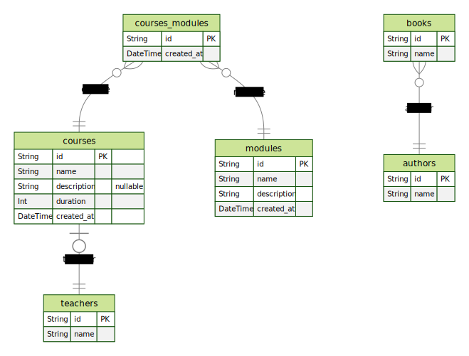

# Estudando Prisma 📚

<p align="center">
  
  
  
  
</p>

<p align="center">
  <a href="#sobre">Sobre</a> •
  <a href="#estudando-prisma">Estudando Prisma</a> •
  <a href="#instalação">Instalação</a> •
  <a href="#tecnologias">Tecnologias</a> •
  <a href="#autor">Autor</a>  
</p>

## Sobre

Projeto desenvolvido durante o curso bônus do Ignite na trilha de NodeJS cujo objetivo era conhecer o ORM Prisma.

## Estudando Prisma

Projeto exploratório com a finalidade de conhecer o ORM Prisma e suas funcionalidades.

Como o projeto é focado na exploração da ferramenta, uma API não foi criada e os scripts de criação e população do banco de dados são executados de maneira avulsa.

Durante o curso algumas tabelas foram criadas para dois momentos: primeiros passos e conceitos mais avançados. Deixo abaixo um registro das tabelas criadas durante o curso como um overview do que foi explorado e construído durante os estudos:



## Instalação

Antes de começar, você vai precisar ter instalado em sua máquina as seguintes ferramentas:
[Git](https://git-scm.com) e [Node.js](https://nodejs.org/en/). Além disso é bom ter um editor para trabalhar com o código como [VSCode](https://code.visualstudio.com/).

### 🎲 Rodando o Back End (servidor)

```bash
# Clone este repositório
$ git clone git@github.com:MrRioja/prismaIOLearning.git

# Acesse a pasta do projeto no terminal/cmd
$ cd prismaIOLearning

# Instale as dependências
$ npm install
# Caso prefira usar o Yarn execute o comando abaixo
$ yarn

# Execute um script desejado com NodeJS e check o resultado da execução
```

## Tecnologias

[](https://skillicons.dev)

## Autor

<div align="center">

<h1>Luiz Rioja</h1>
<strong>Backend Developer</strong>
<br/>
<br/>

<a href="https://linkedin.com/in/luizrioja" target="_blank">

</a>

<a href="https://github.com/mrrioja" target="_blank">

</a>

<a href="mailto:lulyrioja@gmail.com?subject=Fala%20Dev" target="_blank">

</a>

<a href="https://api.whatsapp.com/send?phone=5511933572652" target="_blank">

</a>

<a href="https://join.skype.com/invite/tvBbOq03j5Uu" target="_blank">

</a>

<br/>
<br/>
</div>
